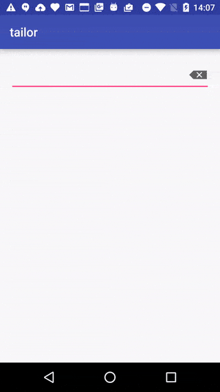

[](https://jitpack.io/#lovoo/tailor)

# tailor
Tailor allows adding click behavior to Android EditText's compound drawables. Written entirely in Kotlin.



## Import
tailor is hosted on JitPack. Therefore you can simply import it by adding

```groovy
allprojects {
    repositories {
        ...
        maven { url "https://jitpack.io" }
    }
}
```

to your projects `build.gradle`.

Then add this to you app's `build.gradle`:

```groovy
dependencies {
    compile 'com.github.lovoo:tailor:1.0'
}
```

## Usage
Using tailor is simple. Just use `ButtonEditText` instead of the default `EditText` or make your implementation a subclass of it.

As with a normal `EditText` you can then add compound drawables to it.

But now you get a new method called `setOnCompoundDrawableClickListener(OnCompoundDrawableClickListener)`. You can pass this method an implementation
of `OnCompoundDrawableClickListener` like this:

```java
buttonEditText.setOnCompoundDrawableClickListener(new OnCompoundDrawableClickListener() {
    @Override
    public void onCompoundDrawableClicked ( CompoundDrawableOnTouchListener.Direction direction ) {
        if (direction == CompoundDrawableOnTouchListener.Direction.DIRECTION_RIGHT) {
            // the right compound drawable has been clicked, delete the text
            setText("");
        }
    }
});
```

Refer to the provided `DeleteButtonEditText` for a more thorough example.

Licence
-------

    Copyright (c) 2016, LOVOO GmbH
    All rights reserved.

    Redistribution and use in source and binary forms, with or without
    modification, are permitted provided that the following conditions are met:

    * Redistributions of source code must retain the above copyright notice, this
      list of conditions and the following disclaimer.

    * Redistributions in binary form must reproduce the above copyright notice,
      this list of conditions and the following disclaimer in the documentation
      and/or other materials provided with the distribution.

    * Neither the name of LOVOO GmbH nor the names of its
      contributors may be used to endorse or promote products derived from
      this software without specific prior written permission.

    THIS SOFTWARE IS PROVIDED BY THE COPYRIGHT HOLDERS AND CONTRIBUTORS "AS IS"
    AND ANY EXPRESS OR IMPLIED WARRANTIES, INCLUDING, BUT NOT LIMITED TO, THE
    IMPLIED WARRANTIES OF MERCHANTABILITY AND FITNESS FOR A PARTICULAR PURPOSE ARE
    DISCLAIMED. IN NO EVENT SHALL THE COPYRIGHT HOLDER OR CONTRIBUTORS BE LIABLE
    FOR ANY DIRECT, INDIRECT, INCIDENTAL, SPECIAL, EXEMPLARY, OR CONSEQUENTIAL
    DAMAGES (INCLUDING, BUT NOT LIMITED TO, PROCUREMENT OF SUBSTITUTE GOODS OR
    SERVICES; LOSS OF USE, DATA, OR PROFITS; OR BUSINESS INTERRUPTION) HOEVER
    CAUSED AND ON ANY THEORY OF LIABILITY, WHETHER IN CONTRACT, STRICT LIABILITY,
    OR TORT (INCLUDING NEGLIGENCE OR OTHERWISE) ARISING IN ANY WAY OUT OF THE USE
    OF THIS SOFTWARE, EVEN IF ADVISED OF THE POSSIBILITY OF SUCH DAMAGE.